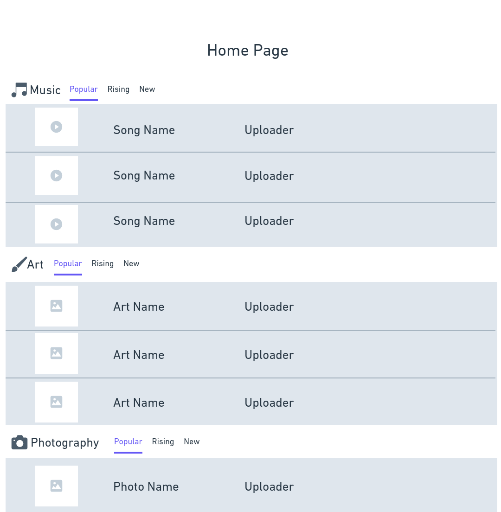

## Team Name: Upsilon

## Innovative Idea: 
A platform for umass students to share music, projects, art, etc. that they may be working on for other Umass students to see and talk about. It will also allow people to set up events, for example a band could set up a small concert and other students could RSVP, or someone could set up an art gallery. Different forms of media would be broken up into separate forums for people to share and discuss their work.

## Important Components:
- Authentication
-- Only UMass students would be able to see & post content, and RSVP to & create events  
- Password Hashing
-- User database will be stored with a username and a hashed version of the password
- Data Storage
-- Posts, User profiles, and Events will be stored locally on the server
- Server-Side
-- Express.js server router

This is the home page users would see when they first access the site, it would have the major categories and a few popular items from each category.

This is the page where users would either login or signup.

This is a sample user profile which would have the person's profile pic, name, graduating class, and some things they uploaded.

## Breakup of Work:
For the wireframes, Casey created the User Page, Julia created the Sign-Up/Login Page, and James created the Home Page. Each person was responsible for the HTML and CSS for their respective page as well.
