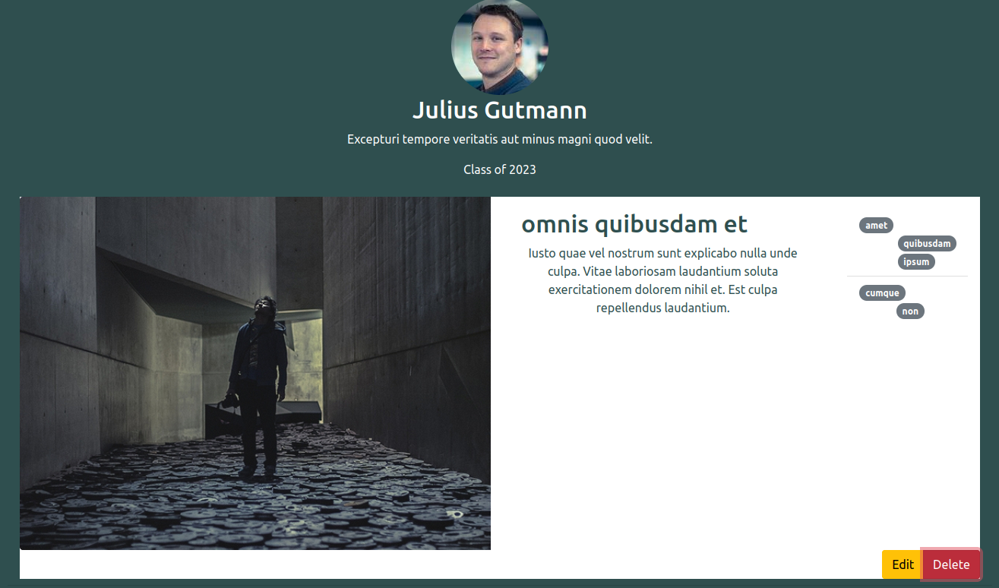
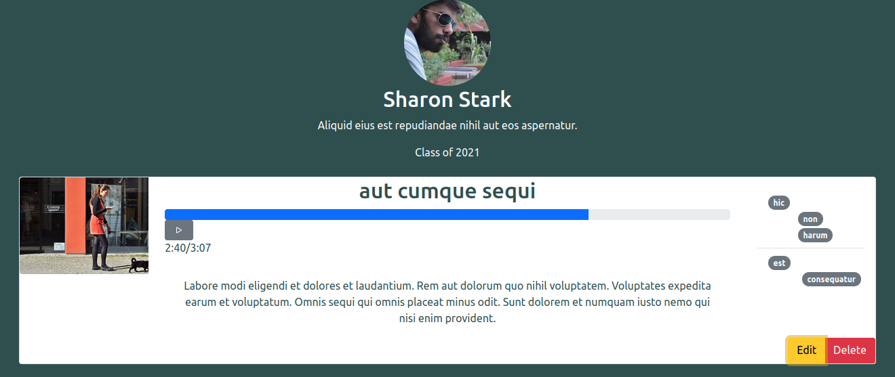
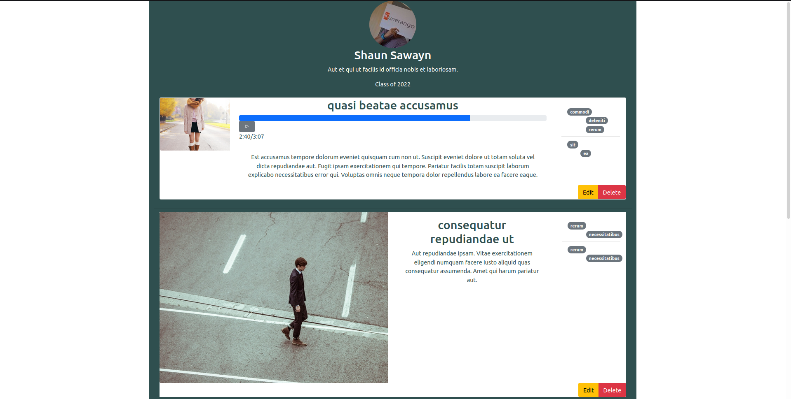

## API Description:
Objects:
- User Object
- - Profile Picture
- - Name
- - Biography
- - Array of (owned) Post Objects Unique IDs
- - Username
- - Unique ID (?)

- Post Object
- - Type (song, image, etc)
- - Content (JSON, just image URL for image, but album art URL and audio file for song)
- - Name
- - Description
- - Tags (JSON)
- - Timestamp
- - Owner
- - Unique ID (?)

API:
- User:
- - POST /signin
- - - Handles credentials required for sign in
- - Create: POST /users/new
- - - Create user account
- - Update: POST /users/:id
- - - Change picture, name, bio, or add a Post Object
- - Read:   GET /users/:id
- - - Get all contents (to be rendered)
- - Delete: POST /users/:id/delete
- - - Delete user account
    
- Post:
- - Create: POST /posts/new
- - - Create new Post Object
- - Update: POST /posts/:id
- - - Edit Name, Description, or Tags
- - Read:   GET /posts/:id
- - - Get all contents and a link to img/video content in DB
- - Delete: POST /posts/:id/delete
- - - Delete post

## Screenshots

This is the button a user will press to delete a post that they made

This is the button a user will press to edit a post that they made

This is a dynamically generated user's page, which reads from the users API to generate its content
## Heroku App URL: https://cs326-finalupsilon.herokuapp.com/

## Division of labor
- Casey
- - [User Profile Page](https://cs326-finalupsilon.herokuapp.com/userPages/exampleUser/)
- - Decent amount of Express server/API

- Julia
- - [Sign-in Page](https://cs326-finalupsilon.herokuapp.com/login/)
- - [Sign-up Page](https://cs326-finalupsilon.herokuapp.com/register/)
- - Sign in and create new user endpoints

- James
- - [Home Page](https://cs326-finalupsilon.herokuapp.com/)
- - Home Page and some Express server/API